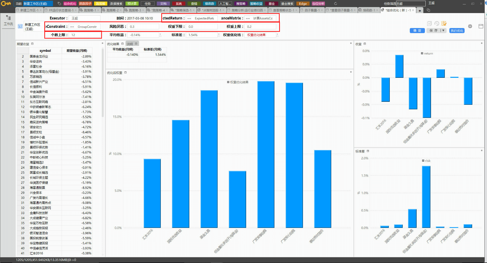

我的工作包含以下几个方面：

- 组合优化
- 行业/市值中性
- Risk Model

## 组合优化

组合优化的参考文献在 `192.168.1.100\public\cwnag\opt` 中，code是 `/opt/GFTCacheServer/RScripts/Portfolioop.R`。
主要用到的 package 是 `PortfolioAnalytics`， 对于求解最优解的算法，主要是 `glpk`，`quadprod`和 `DEoptim`。 
相应的APP为 `64C9DC1C96FD4A0693305C87E905E039`， 在APP界面中，需要输入的参数如图所示：

<br><br>

```{r, echo = FALSE, out.width = "500px"}



```

<br><br>

在`ExpectedReturn/CovarianceMatrix` 的 `...` 中可以选择不同的计算方法，选中任意一个后，需要首先配置基金组合（可以多选，推荐选择一个股票型一个债券型）
在因子模型中还需要选择因子收益的计算模型（包含MA5和ARIMA两种模型），选好之后点击确定。

`GroupConstraint`是为了设置不同类型基金的权重，选择退休年限限制时必须确保基金池中包含债券型基金和股票型基金。
在基金组合的选项中，可以选择一级分类的资产类别，也可以根据自己的基金池自定义基金类型。在右下角配置好权重之后点击绿色的按钮上传，然后点击确定。

风险厌恶是目标函数 $\mu - \lambda*\sigma^{2}$ 中的 $\lambda$, 用来调节目标函数的风险厌恶程度，当 $\lambda == 0$ 时，优化结果为收益最大， 当 $\lambda -> \infty$ 时， 优化结果为风险最小。

权重上下限是对于每个基金权重的限制，确保不会出现单一基金持仓过重的情况。个数上限是最终组合中最大基金数目的限制。

上述参数配置好之后点击执行优化，过一会会出现优化结果。

## 行业/市值中性

参考文献为 [华泰单因子测试之估值类因子](doc/华泰单因子测试之估值类因子.pdf)， 原理同研报中的`单因子分层法`， 行业中性是在每个一级行业内部对所有个股按因子大小进行排序，每个行业内均分成 N 个分层组合。如下图所示，黄色方块代表各行业内个股初始权重，采用等权的方式。每个行业的权重按照基准中行业权重配置。

<br><br>

```{r, echo = FALSE, out.width = "500px"}

knitr::include_graphics("pic/neutral.png")

```

<br><br>

市值中性的原理相同。 

## Figures

The figure sizes have been customised so that you can easily put two images side-by-side. 

```{r, fig.show='hold'}
plot(1:10)
plot(10:1)
```

You can enable figure captions by `fig_caption: yes` in YAML:

    output:
      rmarkdown::html_vignette:
        fig_caption: yes

Then you can use the chunk option `fig.cap = "Your figure caption."` in **knitr**.

## More Examples

You can write math expressions, e.g. $Y = X\beta + \epsilon$, footnotes^[A footnote here.], and tables, e.g. using `knitr::kable()`.

```{r, echo=FALSE, results='asis'}
knitr::kable(head(mtcars, 10))
```

Also a quote using `>`:

> "He who gives up [code] safety for [code] speed deserves neither."
([via](https://twitter.com/hadleywickham/status/504368538874703872))
